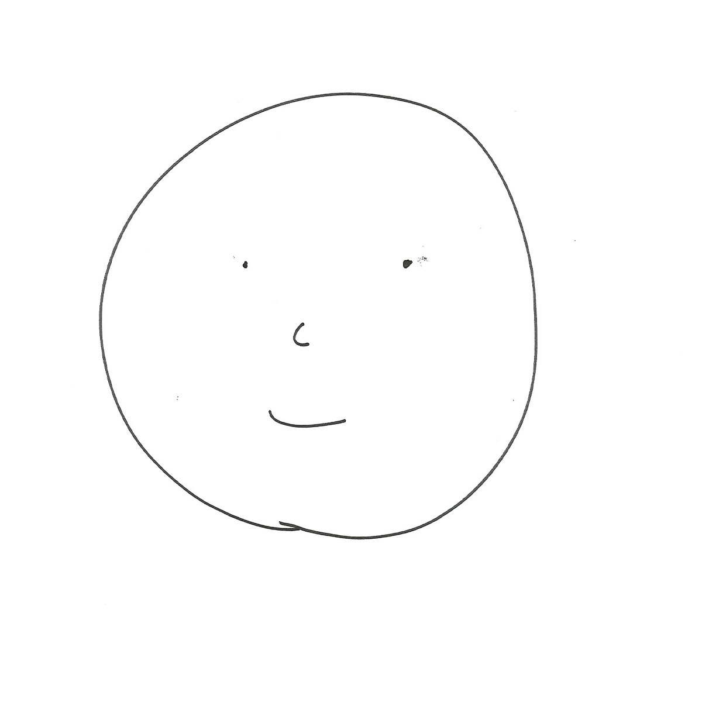
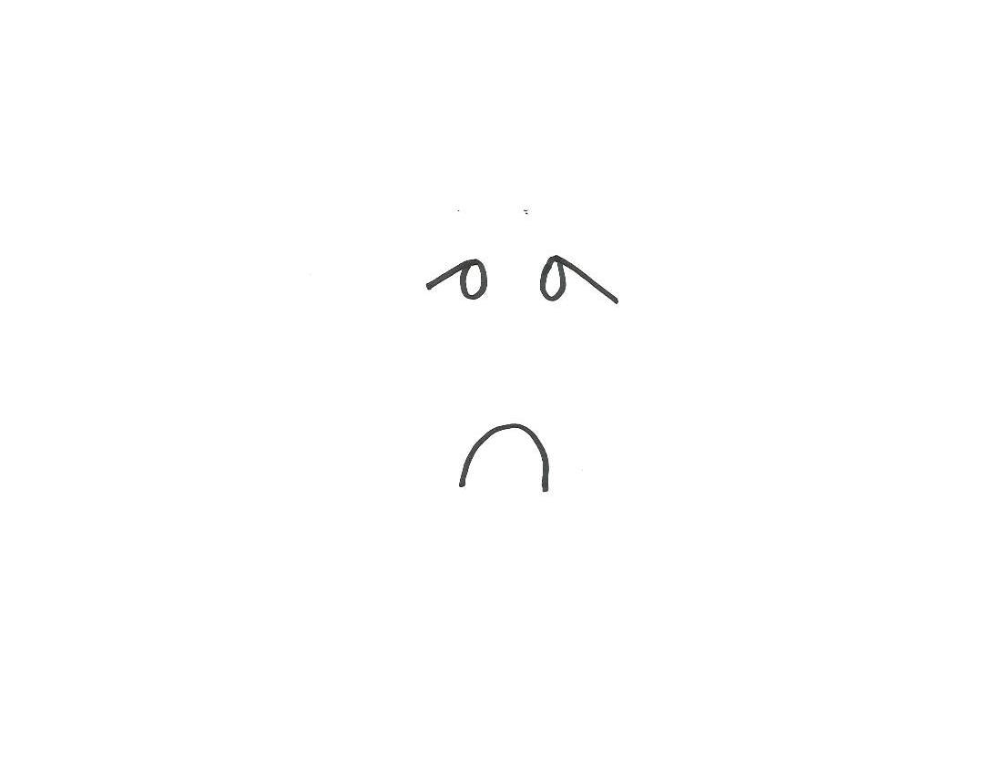

# Smiley Face Discriminator

Using Clarifai's api we created a custom model that discriminates emotional state of a drawn "smiley face". This was part of R/GA / Somatic Hackday March 2017.

## Clarifai setup

We had to create an application to represent the model. We noticed that the application had to be recreated everytime we trained a new model, because it expected unique images. Perhaps if we made the image paths unique during training step we could have avoided this.

Clarifai uses a base image model which is what gives the service its magic. You can use a very small training data set to make custom models that work very well.

## Training images

We scanned about 25 images to be used in positive training.

About 10 images for negatives.

We saved 1 image each from the Positives and Negatives to do a test after training.

## Predictions

We were able to get a decent prediction after this very small training set.

*88% chance of "Smiley" for the postive test
*6% chance of "Smiley" for the negative test
